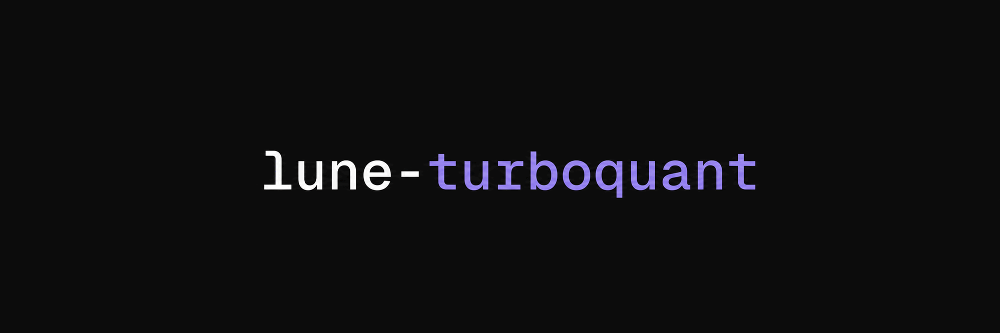

# lune-turboquant

<div align="center">



<b>TurboQuant KV cache compression for llama.cpp</b>

[](https://opensource.org/licenses/MIT)

</div>

A fork of [llama.cpp](https://github.com/ggml-org/llama.cpp) that adds TurboQuant KV cache compression and WHT-rotated weight quantization.

Synced with upstream `llama.cpp` as of `60addddf3` (2026-08-18).

## TurboQuant

TurboQuant rotates the KV cache with a Walsh-Hadamard Transform and then applies PolarQuant, which keeps quality at low bit widths. The KV types are runtime only, so no model conversion is needed.

| KV cache type | Bits |
| --- | --- |
| `turbo2` | 2 |
| `turbo3` | 3 |
| `turbo4` | 4 |

The same rotation is used for two weight quantization types, which do require conversion with `llama-quantize`.

| Weight type | Size |
| --- | --- |
| `TQ3_1S` | 4.00 bpw WHT-rotated |
| `TQ4_1S` | 5.00 bpw WHT-rotated |

## Quick start

Build from source by cloning this repository, check out [our build guide](docs/build.md).

Once built:

```sh
# 3-bit TurboQuant KV cache, with Flash Attention
llama-server -m model.gguf -ctk turbo3 -ctv turbo3 -fa on -ngl 999

# same, for a single interactive session
llama-cli -m model.gguf -ctk turbo3 -ctv turbo3 -fa on -ngl 999

# quantize weights to a WHT-rotated type
llama-quantize model-f16.gguf model-tq4.gguf TQ4_1S
```

`-ctk` and `-ctv` set the K and V cache types independently. Everything else behaves as it does upstream.

## Description

The main goal of `llama.cpp` is to enable LLM (and VLM) inference with minimal setup and state-of-the-art performance on
a wide range of hardware - locally and in the cloud.

- Plain C/C++ implementation without any dependencies
- Apple silicon is a first-class citizen - optimized via ARM NEON, Accelerate and Metal frameworks
- AVX, AVX2, AVX512 and AMX support for x86 architectures
- 1.5-bit, 2-bit, 3-bit, 4-bit, 5-bit, 6-bit, and 8-bit integer quantization for faster inference and reduced memory use
- Custom CUDA kernels for running LLMs on NVIDIA GPUs (support for AMD GPUs via HIP and Moore Threads GPUs via MUSA)
- Vulkan and SYCL backend support
- CPU+GPU hybrid inference to partially accelerate models larger than the total VRAM capacity

The `llama.cpp` project is built on top of the [ggml](https://github.com/ggml-org/ggml) library.

## Supported backends

| Backend | Target devices |
| --- | --- |
| [BLAS](docs/build.md#blas-build) | All |
| [CANN](docs/build.md#cann) | Ascend NPU |
| [CUDA](docs/build.md#cuda) | Nvidia GPU |
| [HIP](docs/build.md#hip) | AMD GPU |
| [MUSA](docs/build.md#musa) | Moore Threads GPU |
| [Metal](docs/build.md#metal-build) | Apple Silicon |
| [OpenCL](docs/backend/OPENCL.md) | Adreno GPU |
| [RPC](https://github.com/ggml-org/llama.cpp/tree/master/tools/rpc) | All |
| [SYCL](docs/backend/SYCL.md) | Intel GPU |
| [Vulkan](docs/build.md#vulkan) | GPU |
| [WebGPU](docs/build.md#webgpu) | All |

TurboQuant KV types are implemented for CUDA, HIP, Metal, Vulkan and SYCL. CUDA is the most tested.

## Documentation

#### Tools

- [cli](tools/cli/README.md)
- [completion](tools/completion/README.md)
- [server](tools/server/README.md)
- [GBNF grammars](grammars/README.md)

#### Development

- [How to build](docs/build.md)
- [Running on Docker](docs/docker.md)
- [Multi-GPU usage](docs/multi-gpu.md)
- [Performance troubleshooting](docs/development/token_generation_performance_tips.md)
- [Models](docs/models.md)

## Credits

- [ggml-org/llama.cpp](https://github.com/ggml-org/llama.cpp) - the upstream project this fork tracks
- [TheTom/llama-cpp-turboquant](https://github.com/TheTom/llama-cpp-turboquant) - the TurboQuant implementation
- [QuinsZouls/llama-cpp-turboquant](https://github.com/QuinsZouls/llama-cpp-turboquant) - earlier TurboQuant work

## Acknowledgements

- [yhirose/cpp-httplib](https://github.com/yhirose/cpp-httplib) - Single-header HTTP server, used by `llama-server` - MIT license
- [stb-image](https://github.com/nothings/stb) - Single-header image format decoder, used by multimodal subsystem - Public domain
- [nlohmann/json](https://github.com/nlohmann/json) - Single-header JSON library, used by various tools/examples - MIT License
- [miniaudio.h](https://github.com/mackron/miniaudio) - Single-header audio format decoder, used by multimodal subsystem - Public domain
- [subprocess.h](https://github.com/sheredom/subprocess.h) - Single-header process launching solution for C and C++ - Public domain
